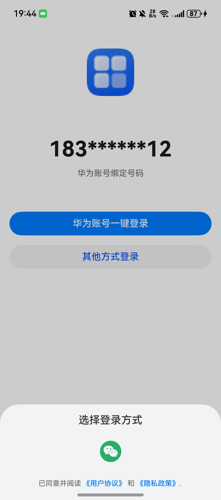

# 登录组件快速入门

## 目录

- [简介](#简介)
- [约束与限制](#约束与限制)
- [快速入门](#快速入门)
- [API参考](#API参考)
- [示例代码](#示例代码)

## 简介

本组件提供了华为账号一键登录及微信一键登录的能力，开发者可以根据业务需要快速实现应用登录。



## 约束与限制

### 环境

- DevEco Studio版本：DevEco Studio 5.0.4 Release及以上
- HarmonyOS SDK版本：HarmonyOS 5.0.4 Release SDK及以上
- 设备类型：华为手机（直板机）
- HarmonyOS版本：HarmonyOS 5.0.4 Release及以上

### 权限

- 网络权限：ohos.permission.INTERNET

## 快速入门

1. 安装组件。    
   如果是在DevEvo Studio使用插件集成组件，则无需安装组件，请忽略此步骤。
   如果是从生态市场下载组件，请参考以下步骤安装组件。  
   a. 解压下载的组件包，将包中所有文件夹拷贝至您工程根目录的xxx目录下。  
   b. 在项目根目录build-profile.json5并添加aggregated_login模块。
   ```typescript
   // 在项目根目录的build-profile.json5填写aggregated_login路径。其中xxx为组件存在的目录名
   "modules": [
     {
       "name": "aggregated_login",
       "srcPath": "./xxx/aggregated_login",
     }
   ]
   ```
   c. 在项目根目录oh-package.json5中添加依赖
   ```typescript
   // xxx为组件存放的目录名称
   "dependencies": {
     "aggregated_login": "file:../xxx/aggregated_login"
   }
   ```
2. 配置华为账号服务。  
   a. 将应用的client ID配置到项目入口模块（例如：entry）的module.json5文件，详细参考：[配置Client ID](https://developer.huawei.com/consumer/cn/doc/harmonyos-guides/account-client-id)。
   ```typescript
   "requestPermissions": [],
   "metadata": [
      {
        "name": "client_id",
        // 配置为获取的Client ID
        "value": "*****"
      },
    ],
    "extensionAbilities": [],
   ```
   b. [配置签名和指纹](https://developer.huawei.com/consumer/cn/doc/harmonyos-guides/account-sign-fingerprints)。

   c. [申请scope权限](https://developer.huawei.com/consumer/cn/doc/harmonyos-guides/account-config-permissions) 。

3. 前往微信开放平台申请AppId并配置鸿蒙应用信息，详情请参考[鸿蒙接入指南](https://developers.weixin.qq.com/doc/oplatform/Mobile_App/Access_Guide/ohos.html)。

4. 引入登录组件句柄。
   ```typescript
   import { Channel, LoginService, LoginType } from 'aggregated_login';
   ```

5. 调用组件，详细参数配置说明参见[API参考](#API参考)

   ```typescript
   // 登录使用
   LoginService({
       icon: $r('app.media.app_icon'),
       privacyPolicyEvent: () => {
         // 跳转页面
          },
       loginBtnBgColor: '#007DFF',
       termOfServiceEvent: () => {
          // 跳转页面
       },
       loginTypes: [new Channel(LoginType.WECHAT, '微信登录', {
          appId: 'wxd5a474c635b8fd17',
          scope: 'snsapi_userinfo,snsapi_friend,snsapi_message,snsapi_contact',
          transaction: 'test123',
          state: 'none',
       }, $r('app.media.wechat'))],
          pathInfos: this.pageInfos,
       });
   ```

## API参考

### 子组件

无

### 接口

LoginService(icon:ResourceStr,loginTypes:Channel[],loginBtnBgColor:ResourceStr,pathInfos:NavPathStack)

登录组件。

**参数：**

| 参数名             | 类型                                                                                                            | 必填 | 说明                                                                                                                              |
|:----------------|:--------------------------------------------------------------------------------------------------------------|:---|:--------------------------------------------------------------------------------------------------------------------------------|
| icon            | [ResourceStr](https://developer.huawei.com/consumer/cn/doc/harmonyos-references-V14/ts-types-V14#resourcestr) | 是  | 应用图标，参考[UX设计规范](https://developer.huawei.com/consumer/cn/doc/harmonyos-guides/account-phone-unionid-login#section2558741102912) |
| loginTypes      | [Channel](#Channeld对象说明)                                                                                      | 是  | 登录渠道信息                                                                                                                          |
| loginBtnBgColor | string                                                                                                        | 是  | 一键登录按钮背景色                                                                                                                       |
| pathInfos       | NavPathStack                                                                                                  | 否  | 应用路由栈                                                                                                                           |

#### Channel对象说明

| 参数名       | 类型                                                                                                            | 必填 | 说明       |
|:----------|:--------------------------------------------------------------------------------------------------------------|:---|:---------|
| type      | [LoginType](#LoginType枚举说明)                                                                                   | 是  | 登录类型     |
| icon      | [ResourceStr](https://developer.huawei.com/consumer/cn/doc/harmonyos-references-V14/ts-types-V14#resourcestr) | 是  | 登录渠道信息   |
| extraInfo | [ExtraInfo](#ExtraInfo对象说明)                                                                                   | 是  | 登录必须信息   |
| click     | ()=>{}                                                                                                        | 否  | 登录图标点击方法 |
| name      | string                                                                                                        | 否  | 登录方式名称   |

#### LoginType枚举说明

| 名称     | 值 | 说明     |
|:-------|:--|:-------|
| HUAWEI | 0 | 华为一键登录 |
| WECHAT | 1 | 微信一键登录 |

#### ExtraInfo对象说明

当登录方式为微信登录时，此对象必传，具体参数含义请参考[鸿蒙接入指南](https://developers.weixin.qq.com/doc/oplatform/Mobile_App/Access_Guide/ohos.html)

| 参数名         | 类型     | 必填 |
|:------------|:-------|:---|
| appId       | string | 是  |
| appKey      | string | 否  |
| scope       | string | 否  |
| transaction | string | 否  |
| state       | string | 否  |

### 事件

支持以下事件：

#### privacyPolicyEvent

privacyPolicyEvent: () => void = () => {}

点击隐私政策时的跳转方法。

#### termOfServiceEvent

privacyPolicyEvent: () => void = () => {}

点击用户协议时的跳转方法。

## 示例代码

```typescript
import { promptAction } from '@kit.ArkUI';
import { Channel, LoginService, LoginType } from 'aggregated_login';

@Entry
@ComponentV2
struct Index {
   pageInfos: NavPathStack = new NavPathStack();
   
   build() {
      RelativeContainer() {
         LoginService({
            icon: $r('app.media.startIcon'),
            privacyPolicyEvent: () => {
               promptAction.showToast({ message: '跳转页面' })
            },
            loginBtnBgColor: '#FF0000',
            termOfServiceEvent: () => {
               promptAction.showToast({ message: '跳转页面' })
            },
            loginTypes: [new Channel(LoginType.WECHAT, '微信登录', {
               appId: 'wxd5a474c635b8fd17',
               scope: 'snsapi_userinfo,snsapi_friend,snsapi_message,snsapi_contact',
               transaction: 'test123',
               state: 'none',
            }, $r('app.media.startIcon'))],
            pathInfos: new NavPathStack(),
            loginFinishedCb: (flag: boolean, unionID?: string) => {
               // 模板忽略登录失败场景
               promptAction.showToast({ message: '登录成功回调' })
            },
         });
      }
      .height('100%')
         .width('100%')
   }
}

```