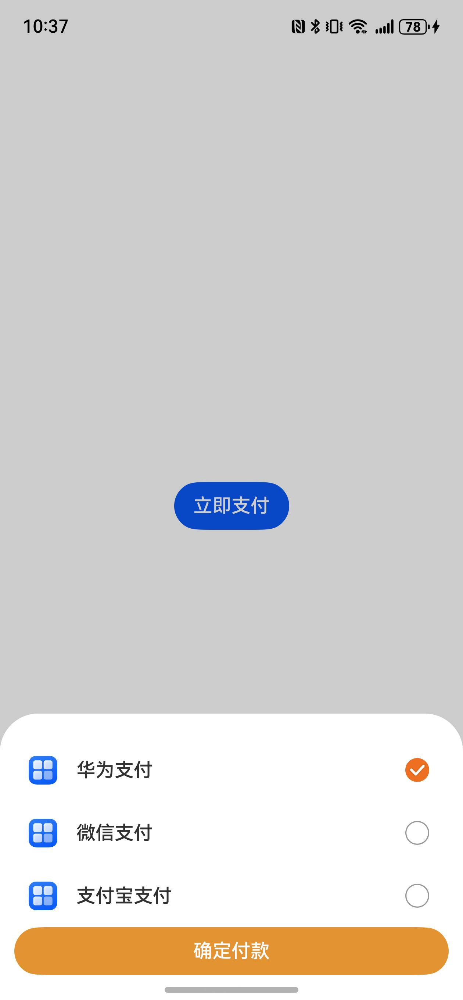

# 支付组件快速入门

## 目录

- [简介](#简介)
- [约束与限制](#约束与限制)
- [快速入门](#快速入门)
- [API参考](#API参考)
- [示例代码](#示例代码)

## 简介

本组件提供了通过华为支付、支付宝支付和微信支付方式进行订单支付的能力，开发者可以根据业务需要选择实现相关支付方式。



## 约束与限制

### 环境

- DevEco Studio版本：DevEco Studio 5.0.4 Release及以上
- HarmonyOS SDK版本：HarmonyOS 5.0.4 Release SDK及以上
- 设备类型：华为手机（直板机）
- HarmonyOS版本：HarmonyOS 5.0.4 Release及以上

### 权限

- 网络权限：ohos.permission.INTERNET

## 快速入门

1. 安装组件。  
   如果是在DevEvo Studio使用插件集成组件，则无需安装组件，请忽略此步骤。
   如果是从生态市场下载组件，请参考以下步骤安装组件。  
   a. 解压下载的组件包，将包中所有文件夹拷贝至您工程根目录的xxx目录下。  
   b. 在项目根目录build-profile.json5并添加aggregated_payment模块。
   ```typescript
   // 在项目根目录的build-profile.json5填写aggregated_payment路径。其中xxx为组件存在的目录名
   "modules": [
     {
       "name": "aggregated_payment",
       "srcPath": "./xxx/aggregated_payment",
     }
   ]
   ```
   c. 在项目根目录oh-package.json5中添加依赖
   ```typescript
   // xxx为组件存放的目录名称
   "dependencies": {
     "aggregated_payment": "file:../xxx/aggregated_payment"
   }
   ```
   
2. [配置签名和指纹](https://developer.huawei.com/consumer/cn/doc/harmonyos-guides/account-sign-fingerprints)。

3. 完成华为支付服务器侧预下单开发，配置[ChannelInfo](#ChannelInfo对象说明)中华为支付的preOrderInfo字段为预下单orderStr，详情参考[商户基础支付场景](https://developer.huawei.com/consumer/cn/doc/harmonyos-guides/payment-payment-process#section126982401468)

   ```typescript
   // 预下单orderStr示例
   hwOrderStr: string = '{"app_id":"***","merc_no":"***","prepay_id":"xxx","timestamp":"1680259863114","noncestr":"1487b8a60ed9f9ecc0ba759fbec23f4f","sign":"****","auth_id":"***"}';
   ```
   
4. 完成微信支付相关的商户权限申请及微信权限开通，并完成App下单相关服务器开发，配置[WxExtraInfo](#WxExtraInfo对象说明)中的相关字段为支付参数，详情请参考[微信App支付](https://pay.weixin.qq.com/doc/v3/merchant/4013070158)
   ```typescript
   // WxExtraInfo对象示例
    {
      partnerId: '****',
      appId: '****',
      packageValue: 'Sign=WXPay',
      prepayId: '****',
      nonceStr: '****',
      timeStamp:'****',
      sign : '****',
      extData: '****'
    }
   ```

5. 引入支付组件句柄。
   ```typescript
   import { AggregatedPaymentPicker, ChannelType, WxExtraInfo } from 'aggregated_payment';
   ```

6. 调用组件，详细参数配置说明参见[API参考](#API参考)

   ```typescript
   AggregatedPaymentPicker({
      channelInfo: [{
        channelType: ChannelType.HUAWEI_PAY,
        name: '华为支付',
        icon: $r('app.media.hwpay'),
        preOrderInfo: this.hwOrderStr,
      }, {
        channelType: ChannelType.WECHAT_PAY,
        preOrderInfo: this.wxOrderReq,
        appId: MockApi.WX_APP_ID,
        icon: $r('app.media.wechat'),
        name: '微信支付',
        event: () => {
          this.isShow = false;
        },
      }, {
        channelType: ChannelType.ALI_PAY,
        name: '支付宝支付',
        icon: $r('app.media.alipay'),
        preOrderInfo: this.aliOrderStr,
      }],
      paySuccessEvent: (type: ChannelType) => {
        promptAction.showToast({
          message: type.toString(),
          duration: 2000,
        });
        this.pageInfos.pushPathByName('NavSample', null);
        this.isShow = false;
      },
    });
   ```

## API参考

### 子组件

无

###  接口

AggregatedPaymentPicker(channelType:ChannelType,adId:string,adType:AdType,appId:string,appName:string,closeCallBack:() => void)

支付组件。

**参数：**

| 参数名           | 类型                              | 必填 | 说明           |
|:--------------|:--------------------------------|:---|:-------------|
| channelType   | [ChannelType](#ChannelType枚举说明) | 是  | 广告渠道信息数组     |
| adId          | string                          | 是  | 广告位ID        |
| adType        | AdType                          | 是  | 广告类型         |
| appId         | string                          | 否  | 应用ID，除华为广告必填 |
| appName       | string                          | 否  | 应用名称，除华为广告必填 |
| closeCallBack | () => void                      | 是  | 关闭广告回调函数     |

#### ChannelType枚举说明

| 名称        | 值 | 说明    |
|:----------|:--|:------|
| HUAWEI_AD | 0 | 华为广告  |
| CSJ_AD    | 1 | 穿山甲广告 |

### 事件

支持以下事件：

#### closeCallBack

closeCallBack: () => void = () => {}

广告关闭时的回调函数。

## 示例代码

本示例提供了实现支付宝支付、华为支付和微信支付的配置

```typescript
import { promptAction } from '@kit.ArkUI';
import { AggregatedPaymentPicker, ChannelType, WxExtraInfo } from 'aggregated_payment';

@Entry
@ComponentV2
struct Index {
   @Local isShow: boolean = false;
   hwOrderStr: string =
      '{"app_id":"***","merc_no":"***","prepay_id":"xxx","timestamp":"1680259863114","noncestr":"1487b8a60ed9f9ecc0ba759fbec23f4f","sign":"****","auth_id":"***"}';
   wxAppId: string = 'wx05b3e2e9fc730840';
   wxOrderReq: WxExtraInfo = {
      partnerId: '2480306091',
      appId: 'wx05b3e2e9fc730840',
      packageValue: 'Sign=WXPay',
      prepayId: 'wx26161523845794ecced251acf2b6860000',
      nonceStr: 'vmall_240926161523_993_2774',
      timeStamp: '1747722044',
      sign: 'rAqsrx5yLfRNBGvlHYuLhUsNK0OPeOLQ5xlvhxFo9guPU4HeNtzRdPaGAXAzXvn7V5chVe8sj3BfvDgwXlCKctCcFIllOgheyZbZ7btFC++9bW0QTijhWo1hZ6LhvjcKQ1zf53RGX7zf7GBu9sheqWPKlWqJJzynBZo8UH5Wow9t/WK5fanNj6ST2U2zPQGxuCH+DBMOKJAhhaalrOXlqj+feEiz1bLAzEmhLzIREgcWJQyZmdI5VO0B8r11ND+o1iBYgoohDUuJc+bd9r6RvmZBSE+HqggWE4p3D0/NzY7mQH+51u0osfOfaTHVLqlUM3IMoXi1vH4a0Qrg1P6c0g==',
      extData: 'extData',
   }
   aliOrderStr: string =
      'app_id=2014100900013222&biz_content=%7B%22timeout_express%22%3A%2230m%22%2C%22product_code%22%3A%22QUICK_MSECURITY_PAY%22%2C%22total_amount%22%3A%220.01%22%2C%22subject%22%3A%221%22%2C%22body%22%3A%22xxx%22%2C%22out_trade_no%22%3A%221749781791192%22%7D&charset=utf-8&method=alipay.trade.app.pay&sign_type=RSA2&timestamp=2016-07-29%2016%3A55%3A53&version=1.0&sign=c5Zc29h1veR5S%2BI3pvGamcT1vGJ7KtBSl8MNvuHXHwyaLcyRVIGEAutETyOqvMgcklNG4E%2F1PxNHqznGIiF69gYTSex1jdaYe21q0TV%2FYw5ulC2ZbCc6zmNViQHMq5UmtByZhNFZZPEC22ff8bXbwQWuINPWLQGChKwi18Bb8xpduC3ZnCI0vdHpPq9%2FefK4SWOuQZdVz%2FvKI0GfhCZdEkmrsi7zEmjWfzeUmKlUQKDGBpZHOXZpz4nSmC7dS3IXwFzP8jQOyy%2BJ%2Ba5cURclCjOmqxpcIGsJP3y243oYqluwGX%2BpyIH%2Fd2U88r0ssKb33Y4kWNJMWRaECJASRhL9OA%3D%3D'

   build() {
      RelativeContainer() {
         Button('立即支付')
            .alignRules({
               center: { anchor: '__container__', align: VerticalAlign.Center },
               middle: { anchor: '__container__', align: HorizontalAlign.Center },
            })
            .bindSheet($$this.isShow, this.paymentChannelSheet(), { showClose: false, height: '30%' })
            .onClick(() => {
               this.isShow = true;
            })
      }
      .height('100%')
         .width('100%')
   }

   @Builder
   paymentChannelSheet() {
      AggregatedPaymentPicker({
         channelInfo: [{
            channelType: ChannelType.HUAWEI_PAY,
            name: '华为支付',
            icon: $r('app.media.startIcon'),
            preOrderInfo: this.hwOrderStr,
         }, {
            channelType: ChannelType.WECHAT_PAY,
            preOrderInfo: this.wxOrderReq,
            appId: this.wxAppId,
            icon: $r('app.media.startIcon'),
            name: '微信支付',
            event: () => {
               this.isShow = false;
            },
         }, {
            channelType: ChannelType.ALI_PAY,
            name: '支付宝支付',
            icon: $r('app.media.startIcon'),
            preOrderInfo: this.aliOrderStr,
         }],
         paySuccessEvent: (type: ChannelType) => {
            promptAction.showToast({
               message: '支付成功~',
               duration: 2000,
            });
            this.isShow = false;
            // 支付成功回调
         },
      });
   }
}
```

