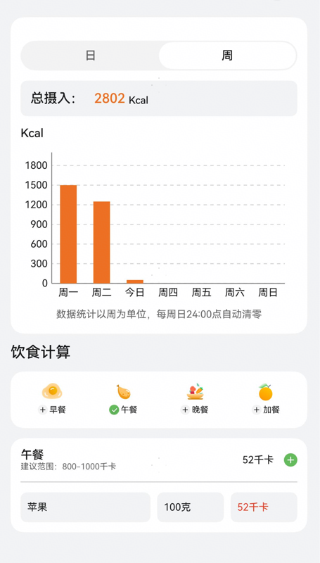

# 热量计算组件快速入门

## 目录
- [简介](#简介)
- [约束与限制](#约束与限制)
- [快速入门](#快速入门)
- [API参考](#API参考)
- [示例代码](#示例代码)

## 简介

本组件提供了展示卡路里计算和统计的相关功能。

| 计算卡路里                                                        | 统计卡路里                                                        |
|--------------------------------------------------------------|--------------------------------------------------------------|
|  |  |

## 约束与限制

### 环境

- DevEco Studio版本：DevEco Studio 5.0.4 Release及以上
- HarmonyOS SDK版本：HarmonyOS 5.0.4 Release SDK及以上
- 设备类型：华为手机（直板机）
- HarmonyOS版本：HarmonyOS 5.0.4 Release及以上

## 快速入门

1. 安装组件。  
   如果是在DevEvo Studio使用插件集成组件，则无需安装组件，请忽略此步骤。
   如果是从生态市场下载组件，请参考以下步骤安装组件。  
   a. 解压下载的组件包，将包中所有文件夹拷贝至您工程根目录的xxx目录下。  
   b. 在项目根目录build-profile.json5并添加base_ui和calorie_calculation模块。
   ```typescript
   // 在项目根目录的build-profile.json5填写base_ui和calorie_calculation路径。其中xxx为组件存在的目录名
   "modules": [
     {
       "name": "base_ui",
       "srcPath": "./xxx/base_ui",
     },
     {
       "name": "calorie_calculation",
       "srcPath": "./xxx/calorie_calculation",
     }
   ]
   ```
   c. 在项目根目录oh-package.json5中添加依赖
   ```typescript
   // xxx为组件存放的目录名称
   "dependencies": {
     "base_ui": "file:../xxx/base_ui",
     "calorie_calculation": "file:../xxx/calorie_calculation"
   }
   ```

2. 引入组件。

   ```typescript
   import { CalorieCalculation } from 'calorie_calculation';
   ```

3. 调用组件，详细参数配置说明参见[API参考](#API参考)。

   ```typescript
   CalorieCalculation({
      seriesData: this.vm.seriesData,
      dietPlanList: this.vm.dietPlanList,
      addMeal: (id: number) => {
        RouterModule.push(RouterMap.DIET_PLAN_PAGE, { 'id': id } as Record<string, number>,
          (popInfo: PopInfo) => {
            this.vm.init()
          })
      },
    })
   ```

## API参考

### 接口

CalorieCalculation(options?: CalorieCalculationOptions)

展示卡路里计算和统计组件。

**参数：**

| 参数名     | 类型                                                          | 必填 | 说明             |
|---------|-------------------------------------------------------------|----|----------------|
| options | [CalorieCalculationOptions](#CalorieCalculationOptions对象说明) | 否  | 展示卡路里计算和统计的参数。 |

### CalorieCalculationOptions对象说明

| 名称           | 类型          | 必填 | 说明      |
|--------------|-------------|----|---------|
| seriesData   | number[]    | 否  | 每日摄入卡路里 |
| dietPlanList | [DietPlans](#DietPlans对象说明)[] | 否  | 卡路里餐食计划 |

### DietPlans对象说明

| 名称            | 类型                 | 必填 | 说明       |
|---------------|--------------------|----|----------|
| id            | number             | 否  | 餐食计划id   |
| name          | string             | 否  | 餐食计划名称   |
| desc          | string             | 否  | 餐食计划描述   |
| totalCalories | number             | 否  | 餐食计划总卡路里 |
| foodList      | [FoodPlanCalories](#FoodPlanCalories对象说明)[] | 否  | 餐食计划食物列表 |

### FoodPlanCalories对象说明

| 名称       | 类型     | 必填 | 说明    |
|----------|--------|----|-------|
| id       | number | 否  | 食物id  |
| name     | string | 否  | 食物名称  |
| weight   | number | 否  | 食物重量  |
| calories | number | 否  | 食物卡路里 |

### 事件

支持以下事件：

#### addMeal

addMeal(callback: (id: number) => void)

点击添加餐食计划的回调。

## 示例代码

```typescript
import { CalorieCalculation, DietPlans, FoodPlanCalories } from 'calorie_calculation';
import { promptAction } from '@kit.ArkUI';

@Entry
@ComponentV2
struct Index {
   @Local seriesData: number[] = [1500, 1250, 1200, 1280, 1650, 1700, 1600];
   @Local dietPlanList: DietPlans[] =
      [new DietPlans(1, 1, '早餐', '描述', 100, [new FoodPlanCalories(1, '面包', 100, 100)])];

   build() {
      RelativeContainer() {
         CalorieCalculation({
            seriesData: this.seriesData,
            dietPlanList: this.dietPlanList,
            addMeal: (id: number) => {
               promptAction.showToast({ message: '跳转加餐' })
            },
         })
      }
      .height('100%')
         .width('100%')
   }
}
```


