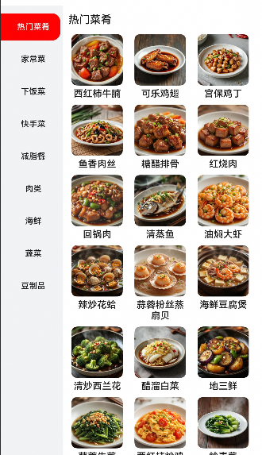

# 分类列表组件快速入门

## 目录
- [简介](#简介)
- [约束与限制](#约束与限制)
- [快速入门](#快速入门)
- [API参考](#API参考)
- [示例代码](#示例代码)

## 简介

本组件提供了分类展示菜谱列表的相关功能。



## 约束与限制

### 环境

- DevEco Studio版本：DevEco Studio 5.0.4 Release及以上
- HarmonyOS SDK版本：HarmonyOS 5.0.4 Release SDK及以上
- 设备类型：华为手机（直板机）
- HarmonyOS版本：HarmonyOS 5.0.4 Release及以上

## 快速入门

1. 安装组件。  
   如果是在DevEvo Studio使用插件集成组件，则无需安装组件，请忽略此步骤。
   如果是从生态市场下载组件，请参考以下步骤安装组件。  
   a. 解压下载的组件包，将包中所有文件夹拷贝至您工程根目录的xxx目录下。  
   b. 在项目根目录build-profile.json5并添加link_category模块。
   ```typescript
   // 在项目根目录的build-profile.json5填写link_category路径。其中xxx为组件存在的目录名
   "modules": [
     {
       "name": "link_category",
       "srcPath": "./xxx/link_category",
     }
   ]
   ```
   c. 在项目根目录oh-package.json5中添加依赖
   ```typescript
   // xxx为组件存放的目录名称
   "dependencies": {
     "link_category": "file:../xxx/link_category"
   }
   ```
   
2. 引入组件。

   ```typescript
   import { LinkCategory } from 'link_category';
   ```

3. 调用组件，详细参数配置说明参见[API参考](#API参考)

   ```typescript
   LinkCategory({
     recipeCategoryList: this.vm.recipeCategoryList,
     currentIndex: this.vm.currentIndex,
     onRecipeClick: (listItem) => {
       // 跳转详情页
     },
     changeCurrentIndex: (index: number) => {
       // 点击分类标签切换index事件
     },
   })
   ```

## API参考

### 接口

LinkCategory(options?: LinkCategoryOptions)

按分类展示菜谱列表组件。

**参数：**

| 参数名     | 类型                                              | 必填 | 说明            |
|---------|-------------------------------------------------|----|---------------|
| options | [LinkCategoryOptions](#LinkCategoryOptions对象说明) | 否  | 按分类展示菜谱列表的参数。 |

### LinkCategoryOptions对象说明

| 名称                 | 类型                                      | 必填 | 说明         |
|--------------------|-----------------------------------------|----|------------|
| recipeCategoryList | [RecipeCategory](#RecipeCategory对象说明)[] | 否  | 今日摄入卡路里    |
| currentIndex       | number                                  | 是  | 左侧分类列表选中序号 |

### RecipeCategory对象说明

| 名称         | 类型                                        | 必填 | 说明       |
|------------|-------------------------------------------|----|----------|
| id         | number                                    | 是  | 菜谱分类序号   |
| name       | string                                    | 是  | 菜谱分类名称   |
| recipeList | [RecipeBriefInfo](#RecipeBriefInfo对象说明)[] | 是  | 菜谱分类里的菜谱 |

### RecipeBriefInfo对象说明

| 名称           | 类型     | 必填 | 说明     |
|--------------|--------|----|--------|
| id           | number | 是  | 菜谱序号   |
| title        | string | 是  | 菜谱名称   |
| description  | string | 否  | 菜谱描述   |
| category     | string | 否  | 菜谱分类   |
| cookingTime  | number | 否  | 菜谱制作时间 |
| difficulty   | string | 否  | 菜谱难度   |
| authorId     | number | 否  | 作者id序号 |
| author       | string | 否  | 作者名称   |
| authorAvatar | string | 否  | 作者头像   |
| thumbnail    | string | 是  | 菜谱缩略图  |
| views        | number | 否  | 浏览数    |
| likes        | number | 否  | 收藏数    |

### 事件

支持以下事件：

#### onRecipeClick

onRecipeClick(callback: (recipeDetail: [RecipeBriefInfo](#RecipeBriefInfo对象说明)) => void)

点击菜谱触发事件
#### changeCurrentIndex

changeCurrentIndex(callback: (currentIndex: number) => void)

点击菜谱分类触发事件
## 示例代码

```typescript
import { RecipeBriefInfo } from 'featured_recipes';
import { LinkCategory, RecipeCategory } from 'link_category';

@Entry
@ComponentV2
struct Index {
   @Local currentIndex: number = 1
   @Local recipeCategoryList: RecipeCategory[] = [{
      id: 1,
      name: '热门菜肴',
      recipeList: [{ id: 1, title: '西红柿炒鸡蛋', thumbnail: 'startIcon' } as RecipeBriefInfo,
         { id: 2, title: '可乐鸡翅', thumbnail: 'startIcon' } as RecipeBriefInfo],
   }, {
      id: 2,
      name: '家常菜',
      recipeList: [{ id: 1, title: '红烧肉', thumbnail: 'startIcon' } as RecipeBriefInfo,
         { id: 2, title: '回锅肉', thumbnail: 'startIcon' } as RecipeBriefInfo],
   }];

   build() {
      RelativeContainer() {
         LinkCategory({
            recipeCategoryList: this.recipeCategoryList,
            currentIndex: this.currentIndex,
            onRecipeClick: (listItem) => {
               // 跳转详情页
            },
            changeCurrentIndex: (index: number) => {
               // 点击分类标签切换index事件
               this.currentIndex = index
            },
         })
      }
      .height('100%')
         .width('100%')
   }
}
```


