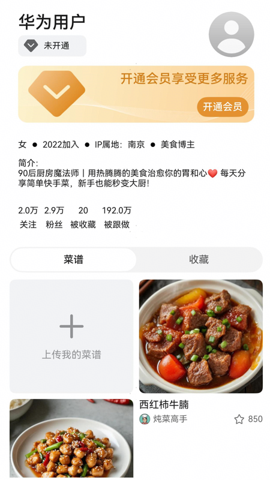

# 个人中心组件快速入门

## 目录
- [简介](#简介)
- [约束与限制](#约束与限制)
- [快速入门](#快速入门)
- [API参考](#API参考)
- [示例代码](#示例代码)

## 简介

本组件提供了个人中心的功能，包含个人简介、发布菜谱和收藏菜谱的相关功能，如果是用户信息支持展示登录和未登录状态。提供用户会员标签、开通会员和上传菜谱插槽，用于自定义相关内容。

| 博主详情                                                       | 登录状态                                                       |
|------------------------------------------------------------|------------------------------------------------------------|
|  |  |

## 约束与限制

### 环境

- DevEco Studio版本：DevEco Studio 5.0.4 Release及以上
- HarmonyOS SDK版本：HarmonyOS 5.0.4 Release SDK及以上
- 设备类型：华为手机（直板机）
- HarmonyOS版本：HarmonyOS 5.0.4 Release及以上

## 快速入门

1. 安装组件。  
   如果是在DevEvo Studio使用插件集成组件，则无需安装组件，请忽略此步骤。
   如果是从生态市场下载组件，请参考以下步骤安装组件。  
   a. 解压下载的组件包，将包中所有文件夹拷贝至您工程根目录的xxx目录下。  
   b. 在项目根目录build-profile.json5并添加base_ui、featured_recipes和personal_homepage模块。
   ```typescript
   // 在项目根目录的build-profile.json5填写base_ui、featured_recipes和personal_homepage路径。其中xxx为组件存在的目录名
   "modules": [
     {
       "name": "base_ui",
       "srcPath": "./xxx/base_ui",
     },
     {
       "name": "featured_recipes",
       "srcPath": "./xxx/featured_recipes",
     },
     {
       "name": "personal_homepage",
       "srcPath": "./xxx/personal_homepage",
     }
   ]
   ```
   c. 在项目根目录oh-package.json5中添加依赖
   ```typescript
   // xxx为组件存放的目录名称
   "dependencies": {
     "base_ui": "file:../xxx/base_ui",
     "featured_recipes": "file:../xxx/featured_recipes",
     "personal_homepage": "file:../xxx/personal_homepage"
   }
   ```
   
2. 引入组件。

   ```typescript
   import { PersonalHomepage } from 'personal_homepage';
   ```

3. 调用组件，详细参数配置说明参见[API参考](#API参考)。

   ```typescript
   PersonalHomepage({
       bloggerInfo: this.vm.bloggerInfo,
       recipeList: this.vm.recipeList,
       isSelf: true,
       isLogin: this.vm.userInfo.isLogin,
       currentIndex: this.vm.currentIndex,
       userTagBuilderParam: (): void => {
         // 用户标签插槽
       },
       membershipBuilderParam: (): void => {
         // 开通会员插槽
       },
       uploadBuilderParam: (): void => {
          // 上传菜谱插槽
       },
       onClickCb: (id: number) => {
         // 跳转菜谱详情
       },
       jumpBloggerInfo: (id: number) => {
         // 跳转博主详情
       },
       changeTabIndex: (index: number) => {
         // 切换tab时，更新数据
       },
       login: () => {
         // 未登录时跳转登录
       },
       jumpFollowers: () => {
         // 跳转关注页面
       },
     })
   ```

## API参考

### 接口

PersonalHomepage(options?: PersonalHomepageOptions)

展示个人中心组件。

**参数：**

| 参数名     | 类型                                                      | 必填 | 说明         |
|---------|---------------------------------------------------------|----|------------|
| options | [PersonalHomepageOptions](#PersonalHomepageOptions对象说明) | 否  | 展示个人中心的参数。 |

### PersonalHomepageOptions对象说明

| 名称           | 类型                                        | 必填 | 说明           |
|--------------|-------------------------------------------|----|--------------|
| bloggerInfo  | [BloggerInfo](#BloggerInfo对象说明)[]         | 是  | 博主个人信息       |
| recipeList   | [RecipeBriefInfo](#RecipeBriefInfo对象说明)[] | 是  | 菜谱列表         |
| isSelf       | boolean                                   | 否  | 是否是个人中心      |
| isLogin      | boolean                                   | 否  | 是否已登录        |
| isFollower   | boolean                                   | 否  | 是否已关注        |
| currentIndex | number                                    | 是  | tab栏索引       |
| isToDelete   | boolean                                   | 否  | 删除场景时是否是删除状态 |

### BloggerInfo对象说明

| 名称             | 类型          | 必填 | 说明    |
|----------------|-------------|----|-------|
| id             | number      | 是  | 博主序号  |
| name           | string      | 是  | 博主名称  |
| avatar         | ResourceStr | 是  | 博主头像  |
| profile        | string      | 是  | 博主简介  |
| sex            | string      | 是  | 博主性别  |
| createdAccount | string      | 是  | 创建日期  |
| ipLocation     | string      | 是  | IP归属地 |
| bloggerType    | string      | 是  | 博主标签  |
| followers      | number      | 是  | 关注数   |
| fans           | number      | 是  | 粉丝数   |
| beFavorite     | number      | 是  | 被收藏   |
| beFollowed     | number      | 是  | 被跟做   |

### RecipeBriefInfo对象说明

| 名称           | 类型     | 必填 | 说明     |
|--------------|--------|----|--------|
| id           | number | 是  | 菜谱序号   |
| title        | string | 是  | 菜谱名称   |
| description  | string | 否  | 菜谱描述   |
| category     | string | 否  | 菜谱分类   |
| cookingTime  | number | 否  | 菜谱制作时间 |
| difficulty   | string | 否  | 菜谱难度   |
| authorId     | number | 是  | 作者id序号 |
| author       | string | 是  | 作者名称   |
| authorAvatar | string | 是  | 作者头像   |
| thumbnail    | string | 是  | 菜谱缩略图  |
| views        | number | 否  | 浏览数    |
| likes        | number | 是  | 收藏数    |

### 事件

支持以下事件：

#### onClickCb

onClickCb(callback: (id: number) => void)

跳转菜谱详情

#### jumpBloggerInfo

jumpBloggerInfo(callback: (id: number) => void)

跳转博主详情
#### changeTabIndex

changeTabIndex(callback: (index: number) => void)

切换tab时，更新数据
#### login

login(callback: () => void)

未登录时跳转登录
#### jumpFollowers

jumpFollowers(callback: () => void)

跳转关注页面

#### deleteRecipes

deleteRecipes(callback: (ids: number[]) => void)

删除场景时，点击删除按钮触发事件

#### changeDeleteState

changeDeleteState(callback: (isToDelete: boolean) => void)

删除场景时，长按菜谱触发删除选中

## 示例代码

### 示例1

```typescript
import { LazyDataSource } from 'featured_recipes';
import { BloggerInfo, PersonalHomepage, RecipeBriefInfo } from 'personal_homepage';

@Entry
@ComponentV2
struct Index {
   @Local bloggerInfo: BloggerInfo = new BloggerInfo()
   @Local currentIndex: number = 1
   @Local recipeList: LazyDataSource<RecipeBriefInfo> = new LazyDataSource();

   aboutToAppear(): void {
      this.bloggerInfo.updateData(0, '华为用户', $r('app.media.startIcon'),
      '90后厨房魔法师｜用热腾腾的美食治愈你的胃和心❤️ 每天分享简单快手菜，新手也能秒变大厨！', '女', '2022加入',
      'IP属地：南京', '美食博主', 20000, 29000, 20, 1920000)
      this.recipeList.pushArrayData([{
         id: 1,
         title: '西红柿炒鸡蛋',
         authorId: 1,
         author: '美食博主',
         authorAvatar: 'startIcon',
         thumbnail: 'startIcon',
         likes: 100,
      } as RecipeBriefInfo, {
         id: 2,
         title: '可乐鸡翅',
         authorId: 1,
         author: '美食博主',
         authorAvatar: 'startIcon',
         thumbnail: 'startIcon',
         likes: 100,
      } as RecipeBriefInfo])
   }

   build() {
      RelativeContainer() {
         PersonalHomepage({
            bloggerInfo: this.bloggerInfo,
            recipeList: this.recipeList,
            isSelf: false,
            isLogin: false,
            currentIndex: this.currentIndex,
            userTagBuilderParam: (): void => {
               // 用户标签插槽
            },
            membershipBuilderParam: (): void => {
               // 开通会员插槽
            },
            uploadBuilderParam: (): void => {
               // 上传菜谱插槽
            },
            onClickCb: (id: number) => {
               // 跳转菜谱详情
            },
            jumpBloggerInfo: (id: number) => {
               // 跳转博主详情
            },
            changeTabIndex: (index: number) => {
               // 切换tab时，更新数据
               this.currentIndex = index
            },
            login: () => {
               // 未登录时跳转登录
            },
            jumpFollowers: () => {
               // 跳转关注页面
            },
         })
      }
      .height('100%')
         .width('100%')
   }
}
```


