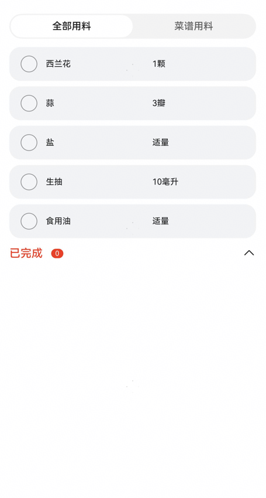
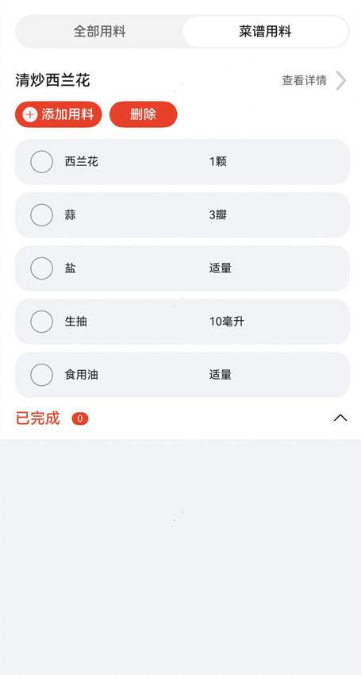

# 菜篮子组件快速入门

## 目录
- [简介](#简介)
- [约束与限制](#约束与限制)
- [快速入门](#快速入门)
- [API参考](#API参考)
- [示例代码](#示例代码)

## 简介

本组件提供了展示菜篮子页面的相关功能。

| 展示所有用料                                                   | 展示菜谱中用料                                                  |
|----------------------------------------------------------|----------------------------------------------------------|
|  |  |

## 约束与限制

### 环境

- DevEco Studio版本：DevEco Studio 5.0.4 Release及以上
- HarmonyOS SDK版本：HarmonyOS 5.0.4 Release SDK及以上
- 设备类型：华为手机（直板机）
- HarmonyOS版本：HarmonyOS 5.0.4 Release及以上

## 快速入门

1. 安装组件。  
   如果是在DevEvo Studio使用插件集成组件，则无需安装组件，请忽略此步骤。
   如果是从生态市场下载组件，请参考以下步骤安装组件。  
   a. 解压下载的组件包，将包中所有文件夹拷贝至您工程根目录的xxx目录下。  
   b. 在项目根目录build-profile.json5并添加base_ui和shopping_basket模块。
   ```typescript
   // 在项目根目录的build-profile.json5填写base_ui和shopping_basket路径。其中xxx为组件存在的目录名
   "modules": [
     {
       "name": "base_ui",
       "srcPath": "./xxx/base_ui",
     },
     {
       "name": "shopping_basket",
       "srcPath": "./xxx/shopping_basket",
     }
   ]
   ```
   c. 在项目根目录oh-package.json5中添加依赖
   ```typescript
   // xxx为组件存放的目录名称
   "dependencies": {
     "base_ui": "file:../xxx/base_ui",
     "shopping_basket": "file:../xxx/shopping_basket"
   }
   ```
   
2. 引入组件。

   ```typescript
   import { ShoppingBasket } from 'shopping_basket';
   ```

3. 调用组件，详细参数配置说明参见[API参考](#API参考)。

   ```typescript
   ShoppingBasket({
     basketList: this.basketList.list,
     goRecipeDetail: (id: number) => {
       // 跳转菜谱详情
     },
     removeRecipe: (param: BasketItem) => {
       // 删除菜篮子里的菜谱
     },
   })
   ```

## API参考

### 接口

ShoppingBasket(options?: ShoppingBasketOptions)

展示菜篮子页面组件。

**参数：**

| 参数名     | 类型                                                  | 必填 | 说明          |
|---------|-----------------------------------------------------|----|-------------|
| options | [ShoppingBasketOptions](#ShoppingBasketOptions对象说明) | 否  | 展示菜篮子页面的参数。 |

### ShoppingBasketOptions对象说明

| 名称         | 类型                              | 必填 | 说明       |
|------------|---------------------------------|----|----------|
| basketList | [BasketItem](#BasketItem对象说明)[] | 否  | 菜篮子里菜谱列表 |

### BasketItem对象说明

| 名称           | 类型                                      | 必填 | 说明      |
|--------------|-----------------------------------------|----|---------|
| id           | number                                  | 是  | 菜谱序号    |
| title        | string                                  | 是  | 菜谱名称    |
| todoList     | [IngredientItem](#IngredientItem对象说明)[] | 是  | 菜谱待完成用料 |
| finishedList | [IngredientItem](#IngredientItem对象说明)[] | 是  | 菜谱已完成用料 |

### IngredientItem对象说明

| 名称       | 类型     | 必填 | 说明      |
|----------|--------|----|---------|
| name     | string | 是  | 用料名称    |
| quantity | string | 是  | 用料数量    |
| unit     | string | 否  | 用料单位    |
| sum      | string | 否  | 总用料     |
| sumArr   | string | 否  | 已完成用料数量 |

### 事件

支持以下事件：

#### goRecipeDetail

goRecipeDetail(callback: (id: number) => void)

跳转菜谱详情

#### removeRecipe

removeRecipe(callback: (param: [BasketItem](#BasketItem对象说明)) => void)

删除菜篮子里的菜谱
## 示例代码

```typescript
import { BasketItem, IngredientItem, ShoppingBasket } from 'shopping_basket';

@Entry
@ComponentV2
struct Index {
   @Local currentIndex: number = 1
   @Local basketList: BasketItem[] =
      [new BasketItem(1, '可乐鸡翅', [new IngredientItem('鸡翅', '500', '克'), new IngredientItem('可乐', '1', '罐')],
         []),
         new BasketItem(2, '西红柿牛腩',
            [new IngredientItem('牛腩', '500', '克'), new IngredientItem('西红柿', '3', '个')], [])]

   build() {
      RelativeContainer() {
         ShoppingBasket({
            basketList: this.basketList,
            goRecipeDetail: (id: number) => {
               // 跳转菜谱详情
            },
            removeRecipe: (param: BasketItem) => {
               // 删除菜篮子里的菜谱
            },
         })
      }
      .height('100%')
         .width('100%')
   }
}
```


