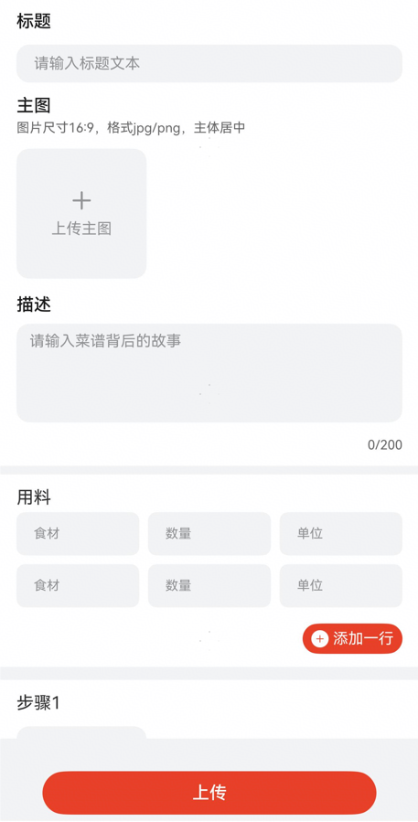

# 上传菜谱组件快速入门

## 目录
- [简介](#简介)
- [约束与限制](#约束与限制)
- [快速入门](#快速入门)
- [API参考](#API参考)
- [示例代码](#示例代码)

## 简介

本组件提供了上传菜谱的相关功能，上传的图片目前保存在沙箱，如需上传至服务器需要自行实现。



## 约束与限制

### 环境

- DevEco Studio版本：DevEco Studio 5.0.4 Release及以上
- HarmonyOS SDK版本：HarmonyOS 5.0.4 Release SDK及以上
- 设备类型：华为手机（直板机）
- HarmonyOS版本：HarmonyOS 5.0.4 Release及以上

## 快速入门

1. 安装组件。  
   如果是在DevEvo Studio使用插件集成组件，则无需安装组件，请忽略此步骤。
   如果是从生态市场下载组件，请参考以下步骤安装组件。  
   a. 解压下载的组件包，将包中所有文件夹拷贝至您工程根目录的xxx目录下。  
   b. 在项目根目录build-profile.json5并添加upload_recipe模块。
   ```typescript
   // 在项目根目录的build-profile.json5填写upload_recipe路径。其中xxx为组件存在的目录名
   "modules": [
     {
       "name": "upload_recipe",
       "srcPath": "./xxx/upload_recipe",
     }
   ]
   ```
   c. 在项目根目录oh-package.json5中添加依赖
   ```typescript
   // xxx为组件存放的目录名称
   "dependencies": {
     "upload_recipe": "file:../xxx/upload_recipe"
   }
   ```

2. 引入组件。

   ```typescript
   import { UploadRecipe } from 'upload_recipe';
   ```

3. 调用组件，详细参数配置说明参见[API参考](#API参考)。

   ```typescript
   UploadRecipe({
     uploadRecipe: (data: UploadRecipeData) => {
       // 调用上传菜谱接口
     },
   })
   ```

## API参考

### 接口
UploadRecipe(options?: UploadRecipeOptions)

上传菜谱组件。


### UploadRecipeData对象说明

| 名称          | 类型                                        | 必填 | 说明    |
|-------------|-------------------------------------------|----|-------|
| title       | string                                    | 否  | 菜谱标题  |
| mainImg     | string                                    | 否  | 菜谱缩略图 |
| description | string                                    | 否  | 菜谱描述  |
| ingredients | [RecipeIngredient](#RecipeIngredient对象说明) | 否  | 用料列表  |
| steps       | [Step](#Step对象说明)                         | 否  | 步骤列表  |

### RecipeIngredient对象说明

| 名称       | 类型     | 必填 | 说明   |
|----------|--------|----|------|
| name     | string | 是  | 用料名称 |
| quantity | string | 是  | 用料数量 |
| unit     | string | 是  | 用料单位 |

### Step对象说明

| 名称          | 类型     | 必填 | 说明   |
|-------------|--------|----|------|
| description | string | 是  | 步骤描述 |
| stepImg     | string | 是  | 步骤图  |

### 事件

支持以下事件：

#### uploadRecipe

uploadRecipe(callback: (data: [UploadRecipeData](#UploadRecipeData对象说明)) => void)

调用上传菜谱接口

## 示例代码

```typescript
import { promptAction } from '@kit.ArkUI';
import { UploadRecipe, UploadRecipeData } from 'upload_recipe';

@Entry
@ComponentV2
struct Index {
   build() {
      RelativeContainer() {
         UploadRecipe({
            uploadRecipe: (data: UploadRecipeData) => {
               promptAction.showToast({ message: '上传成功' })
            },
         })
      }
      .height('100%')
         .width('100%')
   }
}
```


