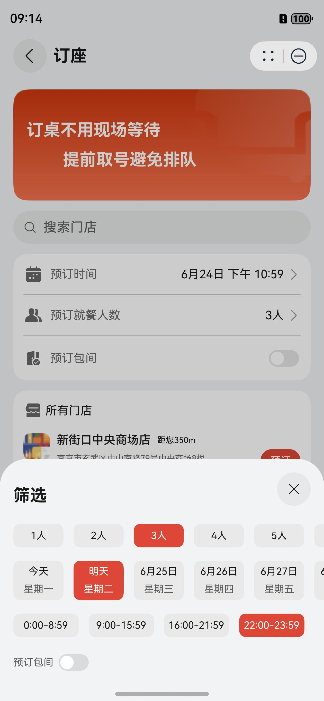

# 美食（餐厅排队）元服务模板快速入门

## 目录

- [功能介绍](#功能介绍)
- [环境要求](#环境要求)
- [快速入门](#快速入门)
- [示例效果](#示例效果)
- [权限要求](#权限要求)
- [开源许可协议](#开源许可协议)

## 功能介绍

您可以基于此[模板](#模板)直接定制应用/元服务，也可以挑选此模板中提供的多种[组件](#组件)使用，从而降低您的开发难度，提高您的开发效率。

### 模板

本模板为餐厅排队元服务提供了常用功能的开发样例，模板主要分首页和我的两大模块：

* 首页：主要提供订座和排号的入口。

* 我的：展示个人信息，提供查看全部订单的入口。

| 首页                                                           | 我的                                                           |
|--------------------------------------------------------------|--------------------------------------------------------------|
|  |  |

本模板主要页面及核心功能如下所示：

```
订座排号模板
 |-- 首页
 |    |-- 顶部Banner
 |    |-- 订座入口
 |    |      |-- 查找浏览
 |    |      |       |-- 文字搜索
 |    |      |       |-- 条件筛选
 |    |      |       └-- 列表展示
 |    |      |-- 立即订座
 |    |      |       |-- 就餐信息
 |    |      |       |-- 基本信息
 |    |      |       |-- 特殊需求
 |    |      |       └-- 其他备注
 |    |      └-- 订座结果
 |    |              |-- 订座信息
 |    |              |-- 预约日历
 |    |              └-- 取消订座
 |    |-- 排号入口
 |    |      |-- 查找浏览
 |    |      |       |-- 文字搜索
 |    |      |       |-- 条件筛选
 |    |      |       └-- 列表展示
 |    |      |-- 立即排号
 |    |      |       |-- 就餐信息
 |    |      |       |-- 排号说明
 |    |      |       └-- 当前排号
 |    |      └-- 排号结果
 |    |              |-- 排号信息
 |    |              |-- 刷新排号
 |    |              └-- 取消排号
 |    └-- 底部Banner
 |
 └-- 我的
      |-- 信息展示
      |-- 订单管理
      |      |-- 订座列表
      |      |       |-- 取消订座
      |      |       └-- 跳转订座
      |      └-- 排号列表
      |              |-- 取消排号
      |              └-- 跳转排号
      └-- 个人设置
             └-- 信息修改
```

本模板工程代码结构如下所示：

```
ReservationQueue
  |- components                                    
  |   └- book_queue/src/main/ets                   // 排号订座模块(har)
  |        |- components                                   
  |        |     |- book                                   
  |        |     |     BookFilterListCom.ets       // 订座条件筛选组件                            
  |        |     |     BookOrderInfoCom.ets        // 订座基本信息组件                            
  |        |     |     BookSpecialServiceCom.ets   // 订座特殊需求组件                            
  |        |     |     BookStoreListCom.ets        // 订座门店列表组件                            
  |        |     |     BookStoreListItemCom.ets    // 订座门店列表项组件      
  |        |     |- common                                   
  |        |     |     CommonBanner.ets            // 公共Banner组件                            
  |        |     |     CommonButton.ets            // 公共按钮组件                            
  |        |     |     CommonHeader.ets            // 公共标题组件    
  |        |     |     CommonListItem.ets          // 公共列表项组件    
  |        |     |     CommonPage.ets              // 公共页面组件    
  |        |     |     CommonSheet.ets             // 公共半模态组件    
  |        |     |     CommonShow.ets              // 公共宣传组件    
  |        |     └- queue                                   
  |        |           QueueFilterListCom.ets      // 排号条件筛选组件                            
  |        |           QueueStoreListCom.ets       // 排号门店列表组件                            
  |        |- constants                                
  |        |     Common.ets                        // 公共常量和页面枚举
  |        |     Constants.ets                     // 订座排号业务相关常量
  |        |     Styles.ets                        // 公共容器样式
  |        |- network                                
  |        |     |- apis                           // 网络接口  
  |        |     |     ApiList.ets                 // 真实请求     
  |        |     |     HttpRequest.ets                  
  |        |     |- mocks                          // 数据mock   
  |        |     |      └- mockdata
  |        |     |            StoreInfo.ets        // 门店信息           
  |        |     |     AxiosMock.ets                  
  |        |     |     RequestMock.ets             // 模拟请求     
  |        |     └- types                          // 请求和响应类型    
  |        |           RequestParams.ets           // 请求类型     
  |        |           RequestUrl.ets              // 请求Url     
  |        |           ResponseTypes.ets           // 响应类型     
  |        |- pages                                   
  |        |     |- book                                   
  |        |     |     BookOrderPage.ets           // 订座预订页                             
  |        |     |     BookPage.ets                // 订座浏览页                            
  |        |     |     BookResPage.ets             // 订座结果页                                
  |        |     |- order                                   
  |        |     |     OrderPage.ets               // 订单管理页                             
  |        |     └- queue                                   
  |        |           QueueOrderPage.ets          // 排号预订页                            
  |        |           QueuePage.ets               // 排号浏览页   
  |        |           QueueResPage.ets            // 排号结果页   
  |        |- types                                
  |        |     NavRouterInfo.ets                 // 路由类型
  |        |     Types.ets                         // 业务类型
  |        |- utils                                
  |        |     AlertUtil.ets                     // 弹窗确定工具
  |        |     CalenderUtil.ets                  // 日程管理工具
  |        |     Dialog.ets                        // 排号弹窗工具
  |        |     Format.ets                        // 格式化工具
  |        |     FullLoading.ets                   // 请求弹窗工具
  |        |     Logger.ets                        // 日志打印工具
  |        |     OrderUtil.ets                     // 订单管理工具
  |        |     RouterModule.ets                  // 路由管理工具
  |        |     WidgetUtil.ets                    // 卡片管理工具
  |        |     WindowUtil.ets                    // 窗口管理工具
  |        └- viewmodels                             
  |              BookVM.ets                        // 订座视图模型
  |              OrderVM.ets                       // 订单视图模型
  |              QueueVM.ets                       // 排号视图模型
  |
  └- products                                        
      └- phone/src/main/ets                        // 入口模块(hap)
           |- components                                   
           |     └- mine                                   
           |           AvatarButton.ets            // 头像选择按钮组件                            
           |           HeaderPart.ets              // 顶部个人信息组件                            
           |           Settings.ets                // 更多相关设置组件   
           |     CommonButton.ets                  // 公共按钮组件                               
           |     CommonHeader.ets                  // 公共标题组件                                                         
           |- constants                                
           |     CommonConstants.ets               // 公共常量
           |     CommonEnum.ets                    // 公共枚举
           |- entryability                                
           |     EntryAbility.ets                  // 应用生命周期
           |- network                                
           |     |- apis                           // 网络接口  
           |     |     ApiList.ets                 // 真实请求     
           |     |     HttpRequest.ets                  
           |     |- mocks                          // 数据mock   
           |     |      └- MockData
           |     |            UserInfo.ets         // 用户信息           
           |     |     AxiosMock.ets                  
           |     |     RequestMock.ets             // 模拟请求     
           |     └- types                          // 请求和响应类型    
           |           RequestUrl.ets              // 请求Url     
           |           ResponseTypes.ets           // 响应类型     
           |- pages                                   
           |     HomePage.ets                      // 首页视图页面     
           |     MainEntry.ets                     // 应用入口页面     
           |     MinePage.ets                      // 我的视图页面     
           |     ProfileEditPage.ets               // 信息编辑页面     
           |- phoneformability                                
           |     PhoneFormAbility.ets              // 卡片生命周期
           |- types                                
           |     Types.ets                         // 业务类型
           |     UserInfo.ets                      // 用户类型
           |- utils                                
           |     AccountUtil.ets                   // 账号管理工具
           |     Logger.ets                        // 日志打印工具
           |     TelUtil.ets                       // 电话处理工具
           |     WindowUtil.ets                    // 窗口管理工具
           |- viewmodels                             
           |     EntryVM.ets                       // 入口视图模型
           |     HomeVM.ets                        // 首页视图模型
           |     MineVM.ets                        // 我的视图模型
           └- widget                                   
                 └- pages                                   
                       WidgetCard.ets              // 服务卡片页面                            
```

### 组件

本模板中还提供了如下组件，您可以按需选择使用，所有组件存放在工程根目录的components下。

| 组件                | 描述                    | 使用指导                                      |
|-------------------|-----------------------|-------------------------------------------|
| 订座排号组件（BookQueue） | 支持浏览门店、订座、排号、查看订单等功能。 | [使用指导](./components/book_queue/README.md) |

## 环境要求

### 软件

* DevEco Studio版本：DevEco Studio 5.0.0 Release及以上
* HarmonyOS SDK版本：HarmonyOS 5.0.0 Release SDK及以上

### 硬件

* 设备类型：华为手机（直板机）
* HarmonyOS版本：HarmonyOS 5.0.0 Release及以上

## 快速入门

### 配置工程

在运行此模板前，需要完成以下配置：

1. 在AppGallery Connect创建元服务，将包名配置到模板中。

   a. 参考[创建元服务](https://developer.huawei.com/consumer/cn/doc/app/agc-help-createharmonyapp-0000001945392297)
   为元服务创建APP ID，并将APP ID与元服务进行关联。

   b. 返回应用列表页面，查看元服务的包名。

   c. 将模板工程根目录下AppScope/app.json5文件中的bundleName替换为创建元服务的包名。

2. 配置华为账号服务。 将元服务的client
   ID配置到products/phone/src/main路径下的module.json5文件，详细参考：[配置Client ID](https://developer.huawei.com/consumer/cn/doc/atomic-guides/account-atomic-client-id)。

3. 对元服务进行
   [手工签名](https://developer.huawei.com/consumer/cn/doc/harmonyos-guides/ide-signing#section297715173233)。

4. 添加手工签名所用证书对应的公钥指纹。 详细参考：
   [配置应用签名证书指纹](https://developer.huawei.com/consumer/cn/doc/app/agc-help-signature-info-0000001628566748#section5181019153511)

### 运行调试工程

1. 用USB线连接调试手机和PC。

2. 运行模块选择“phone”。点击"Run"，运行模板工程。


## 示例效果

| 订座                                                           | 排号                                                            | 订单                                                            | 卡片                                                           |
|--------------------------------------------------------------|---------------------------------------------------------------|---------------------------------------------------------------|--------------------------------------------------------------|
|  |  |  |  |

## 权限要求

* 网络权限：ohos.permission.INTERNET
* 读日历权限：ohos.permission.READ_CALENDAR
* 写日历权限：ohos.permission.WRITE_CALENDAR

## 开源许可协议

该代码经过[Apache 2.0 授权许可](http://www.apache.org/licenses/LICENSE-2.0)。