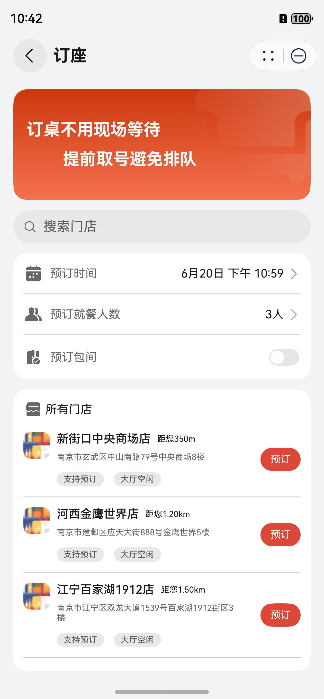
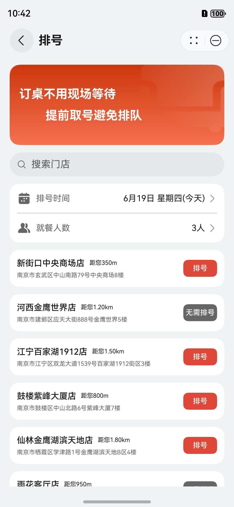
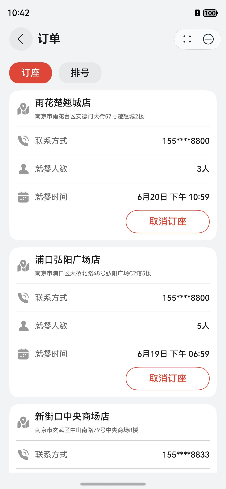

# 订座排号组件快速入门

## 目录

- [简介](#简介)
- [使用](#使用)
- [API参考](#API参考)
- [示例代码](#示例代码)

## 简介

本模块提供了浏览门店、立即订座、取消订座、立即排号、取消排号、刷新排号、查看订单等相关的能力，可以帮助开发者快速集成订座排号的相关业务。

| 订座                                                           | 排号                                                            | 订单                                                            |
|--------------------------------------------------------------|---------------------------------------------------------------|---------------------------------------------------------------|
|  |  |  |

## 使用

1. 确定依赖。book_queue模块依赖@ohos/axios、@hw-agconnect/ui-skeleton三方库。

   ```
   // book_queue模块内部依赖情况
   "dependencies": {
      "@hw-agconnect/ui-skeleton": "^1.0.0",
      "@ohos/axios": "^2.2.4"
   }
   ```

2. 安装模块。将模板根目录的components下**book_queue**目录拷贝至您的工程相应目录。
   ```
   // 项目根目录下build-profile.json5填写book_queue路径
   "modules": [
      {
      "name": "book_queue",
      "srcPath": "./components/bookqueue"
      }
   ]
   ```

   ```
   // 模块使用方目录下module.json5填写book_queue依赖
   "dependencies": {
      "book_queue": "file:../../components/bookqueue"
   }
   ```

3. 模块初始化。详细入参配置说明参见[API参考](#API参考)。

   ```
   BookQueue.init(this.stack, this.getUIContext(), true);
   ```

4. 页面跳转，详细页面配置说明参见[API参考](#API参考)。

   ```
   this.stack.pushPathByName(BookQueueRouterMap.BOOK_PAGE, null)
   ```

## API参考

### 子组件

无

### init

BookQueue.init(stack: NavPathStack, ctx: UIContext, fullScreen: boolean)

订座排号初始化。

**参数：**

| 参数名        | 类型                                                                                                                              | 是否必填 | 说明                    |
|------------|---------------------------------------------------------------------------------------------------------------------------------|------|-----------------------|
| stack      | [NavPathStack](https://developer.huawei.com/consumer/cn/doc/harmonyos-references/ts-basic-components-navigation#navpathstack10) | 是    | 模块内页面跳转所需的路由栈对象       |
| ctx        | [UIContext](https://developer.huawei.com/consumer/cn/doc/harmonyos-references/js-apis-arkui-uicontext#uicontext)                | 是    | 相关弹窗构建所需的上下文          |
| fullScreen | boolean                                                                                                                         | 是    | 模块内页面是否开启沉浸式,与项目保持一致。 |

### BookQueueRouterMap

订座排号页面名。

**枚举：**

| 枚举名              | 对应页面   |
|------------------|--------|
| BOOK_PAGE        | 订座开始页面 |
| BOOK_ORDER_PAGE  | 订座订单页面 |
| BOOK_RES_PAGE    | 订座结果页面 |
| QUEUE_PAGE       | 排号开始页面 |
| QUEUE_ORDER_PAGE | 排号订单页面 |
| QUEUE_RES_PAGE   | 排号结果页面 |
| ORDER_LIST_PAGE  | 订单管理页面 |

### RouterModule

路由管理工具。

**方法：**

| 方法名         | 功能                 |
|-------------|--------------------|
| push        | 页面跳转(指定页面)         |
| replace     | 页面替换(指定页面)         |
| pop         | 页面回退(上个页面)         |
| popWithRes  | 页面回退(携带参数)         |
| popToName   | 页面回退(至对应页面名)       |
| clear       | 页面栈清空(回Navigation) |
| size        | 获取页面栈大小            |
| getNavParam | 获取参数(指定页面)         |
| getPrePage  | 获取页面名(前页面)         |
| getNowPage  | 获取页面名(当前页面)        |

### WidgetUtil

卡片管理工具。

**方法：**

| 方法名              | 功能       |
|------------------|----------|
| getFormIds       | 获取卡片ID   |
| addFormId        | 添加卡片ID   |
| delFormId        | 删除卡片ID   |
| publishFormId    | 发送卡片ID   |
| subscribeFormId  | 接收卡片ID   |
| getQueueOrder    | 获取最近排号订单 |
| publishQueueId   | 发送排号订单ID |
| subscribeQueueId | 接收排号订单ID |
| updateWidgets    | 更新卡片     |
| resetWidgets     | 重置卡片     |

### QueueOrder

卡片排号订单对象。

| 字段名     | 类型     | 说明   |
|---------|--------|------|
| orderId | number | 订单ID |
| count   | number | 桌数人数 |
| mine    | number | 我的排号 |
| now     | number | 当前排号 |
| wait    | number | 等待桌数 |

### cancelQueueOrderApi

cancelQueueOrderApi(orderId: number)

取消排号订单。

| 参数名     | 类型     | 说明       |
|---------|--------|----------|
| orderId | number | 取消排号订单ID |

## 示例代码

本示例通过pushPathByName选择BookQueueRouterMap实现不同业务页面的跳转。

```
import { BookQueue, BookQueueRouterMap } from 'book_queue';

@Entry
@ComponentV2
struct Index {
  stack: NavPathStack = new NavPathStack();
  
  aboutToAppear(): void {
    BookQueue.init(this.stack, this.getUIContext(), false);
  }

  build() {
    Navigation(this.stack) {
      Column({ space: 20 }) {
        Button('Book').onClick(() => {
          this.stack.pushPathByName(BookQueueRouterMap.BOOK_PAGE, null);
        })

        Button('Queue').onClick(() => {
          this.stack.pushPathByName(BookQueueRouterMap.QUEUE_PAGE, null);
        })

        Button('Order').onClick(() => {
          this.stack.pushPathByName(BookQueueRouterMap.ORDER_LIST_PAGE, null);
        })
      }
      .justifyContent(FlexAlign.Center)
      .height('100%')
    }
    .hideToolBar(true)
    .hideTitleBar(true)
    .hideBackButton(true)
    .mode(NavigationMode.Stack)
  }
}
```
